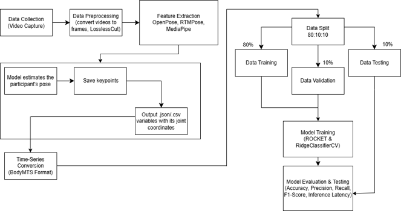
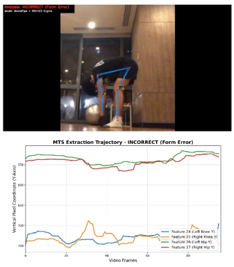

# Multivariate Time-Series Classification for Squat Variations and Stiff-Leg Deadlift Form Analysis using Pose Estimation

This repository contains the official implementation, experimental architecture, and data preprocessing configurations for the BodyMTS classification pipeline presented by Marichella Salve M. Mendoza (Mapua University, 2026). 

This research introduces a framework designed to automate human exercise form assessment by converting visual joint data into structured temporal signs. With the fusion of 2D Human Pose Estimation and Multivariate Time Series Classification (MTSC), the pipeline accurately evaluates strength and conditioning (S&C) performance, discerning proper executions from specific, injury-inducing biomechanical deviations.

System Architecture & Workflow

[cite_start]***Fig 1** Conceptual Framework of the implemented BodyMTS processing pipeline[cite: 13]. [cite_start]The architecture maps the entire sequential flow from raw dynamic video capture, processing through localized 2D pose estimation arrays (OpenPose/MediaPipe/RTMPose), sktime conversion, and subsequent 80:10:10 cross-validation partitioning for high-dimensional ROCKET and RidgeClassifierCV evaluation[cite: 13].*

## Live AI (XAI) Dashboard

[cite_start]The framework integrates an interactive analysis interface that graphs vertical joint displacement curves over a repetition's temporal duration[cite: 521]. [cite_start]This helps human reviewers visually audit model decisions[cite: 521].

[cite_start]***Fig 2** Live XAI Dashboard display capturing an incorrect Stiff-Leg Dumbbell Deadlift (SD) execution using the MediaPipe feature extractor[cite: 37, 819]. [cite_start]The lower graph plots the vertical displacement trajectory ($Y$-axis) across frames[cite: 666, 803]. [cite_start]A restricted hip extension curve (Features 26 and 27) maps structural hinge constraints and spinal rounding, allowing the ROCKET engine to successfully flag the movement profile as an **INCORRECT (Form Error)** execution[cite: 821, 824].*
